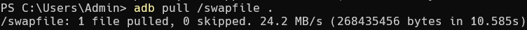

# Simple Debug Bridge Daemon (SDBD)

**Fully compatible with ADBD 🥳🥳🥳**

## Design goal

- Single file implementation, lightweight.

- Event driven, fully ASYNC framework, high-performance.

## Features

- [x] Daemon mode
- [x] Version 2 transmission protocol
- [x] Shell version 2, can change windows size
- [x] Automatic timeout close for unresponsive services
- [x] Cross endianness (Big-Endian / Little-Endian)
- [x] USB hot plugging
- [x] Shell command
- [x] Reboot command
- [x] Remount command
- [x] Intel SSE2 / Arm Neon HW acceleration

### Support commands

```shell
$ adb shell [args] ... # interactive shell
$ adb reboot [args] ... # reboot device
$ adb remount # remount /system
$ adb push local-path remote-path # push files to device
$ adb pull remote-path local-path # pull files from device
```

## Benchmark test

SDBD speed:


SDBD v2 speed:



ADBD speed:


**SDBD is 14.2 times the speed of ADBD.**

## How to use

Usage:

```shell
$ sdbd --help
Usage: ./sdbd [option] ...
Simple Debug Bridge Daemon (SDBD) v0.2
Hardware Acceleration: 'Arm Neon'

Options:
  -h, --help            Display this information.
  -v, --version         Display version information.
  -d, --daemon          Run in daemon mode.
  -l, --loglevel=LEVEL  Set print log level threshold.
  -t, --timout=SECONDS  Set service idle timeout value.

The following optionals are for loglevel:
  0: Emerg    (System is unusable)
  1: Alert    (Action must be taken immediately)
  2: Crit     (Critical conditions)
  3: Error    (Error conditions)
  4: Warning  (Warning conditions)
  5: Notice   (Normal but significant condition)
  6: Info     (Informational)
  7: Debug    (Debug-level messages)

For bug reporting, please visit:
<https://github.com/openbfdev/sdbd>
```

## Reference link

- [xdbd](https://github.com/openbfdev/xdbd): https://github.com/openbfdev/xdbd
- [adbd](https://github.com/BigfootACA/adbd): https://github.com/BigfootACA/adbd
- [google-adbd](https://android.googlesource.com/platform/system/adb): https://android.googlesource.com/platform/system/adb

## License

This is free software: you can redistribute it and/or modify it under the terms of the latest GNU Lesser General Public License as published by the Free Software Foundation.

This program is distributed in the hope that it will be useful, but WITHOUT ANY WARRANTY; without even the implied warranty of MERCHANTABILITY or FITNESS FOR A PARTICULAR PURPOSE. See the GNU Lesser General Public License for more details.

You should have received a copy of the GNU Lesser General Public License along with this program. If not, see http://www.gnu.org/licenses/.
