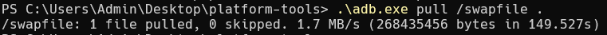

# Simple Debug Bridge Daemon (SDBD)

**Fully compatible with ADBD 🥳🥳🥳**

## Design goal

- Single file implementation, lightweight.

- Event driven, fully ASYNC framework, high-performance.

## Features

- [x] Daemon mode
- [x] Support USB hot plugging
- [x] Shell command
- [x] Reboot command
- [x] Remount command
- [x] File sync commands (push pull)

### Support commands

```shell
$ adb shell [args] ... # interactive shell
$ adb reboot [args] ... # reboot device
$ adb remount # remount /system
```

## Benchmark Test

sdbd speed:


adbd speed:



**SDBD is five times the speed of ADBD.**

## Reference Link

- [xdbd](https://github.com/openbfdev/xdbd): https://github.com/openbfdev/xdbd
- [adbd](https://github.com/BigfootACA/adbd): https://github.com/BigfootACA/adbd

## License

This is free software: you can redistribute it and/or modify it under the terms of the latest GNU Lesser General Public License as published by the Free Software Foundation.

This program is distributed in the hope that it will be useful, but WITHOUT ANY WARRANTY; without even the implied warranty of MERCHANTABILITY or FITNESS FOR A PARTICULAR PURPOSE. See the GNU Lesser General Public License for more details.

You should have received a copy of the GNU Lesser General Public License along with this program. If not, see http://www.gnu.org/licenses/.
